Exported from /Users/amylouise/Documents/github/com.unity.progrids/Documentation~/TableOfContents.md

# About ProGrids

Grid snapping keeps objects aligned and evenly spaced. This is an important part of just about every level design workflow.

When you use ProGrids snapping in Unity, any object you move snaps to the **world grid** as you move it. The world grid never changes position or orientation. This means you always know exactly where items are, how far they are from each other, and how far you are moving them.

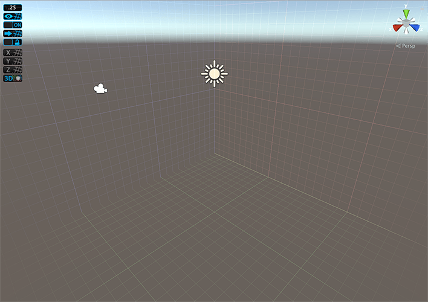

## ProGrids and ProBuilder

ProGrids helps you build levels and greybox with [ProBuilder](https://docs.unity3d.com/Packages/com.unity.probuilder@latest) by helping you create proportional, clean geometry that you can easily resize and expand. For example, if you snap to the grid while creating your geometry, it's easy to end up with perfectly straight right angles.

ProGrids also provides excellent visual cues to help you extrude faces and edges evenly because the grid is in world space.

You can use the larger snap values to create the exterior walls, and then switch to smaller snap values to create insets or details.

## Helpful Links

- [Installing ProGrids](install.md)
- [Getting Started tutorial](https://youtu.be/1G-0f5m1_lw)
- [Documentation](https://docs.unity3d.com/Packages/com.unity.progrids@latest)
- [Support forum](https://forum.unity.com/forums/world-building.146/)

----

## Installing ProGrids

To install ProGrids in your Unity Project:

1. Follow the steps for installing a package from the registry from the [Packages documentation in the Unity Manual](https://docs.unity3d.com/Manual/upm-ui-install.html). 

2. Verify that ProGrids is correctly installed by opening **Tools** > **ProGrids** > **ProGrids Window**.

To close ProGrids:

* Select **Tools** > **ProGrids** > **Close ProGrids**.

For information on using specific ProGrid features, see [The Interface](interface.md).

### Upgrading from early versions of ProGrids

To upgrade a Unity Project with ProGrids already present:

1. Open the Project in Unity 2018.1 or later.

2. Delete the **ProGrids** folder in the Project view.

3. Install the ProGrids package as described above.

----

## The Interface

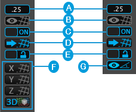 

 [Snap Settings](snapping.md). Set the size of the grid's snapping increment. 

 [Grid Visibility](#grid-vis). Toggle whether to display or hide gridlines in the Scene view.

 [Snapping Enabled](#snap). Toggle whether to snap objects to the grid on or off. 

 [Push to Grid](#push). Snap all selected object(s) to the grid.  

 [Follow Grid](#follow). Lock the perspective grid in place. 

 [Set Grid Planes](grids.md). You can choose to display the grid for a single axis (**X**, **Y**, **Z**) or all three at once (the **Perspective Grid**). These buttons are only available when the Scene view is set to the [perspective mode](https://docs.unity3d.com/Manual/SceneViewNavigation.html).

 [Angle Visibility](#angle-vis). Toggle the visibility of the angle guides. This button is only available when the Scene view is set to the [orthographic mode](https://docs.unity3d.com/Manual/SceneViewNavigation.html).

> **TIP**: You can use [Keyboard Shortcuts](hotkeys.md) to change these settings quickly.

###  Grid Visibility

Use this button to switch between whether the grid is visible or not. 

When you enable or disable this setting it only affects the visibility of the grid. Objects still snap to the grid even when you disable grid visibility.

###  Snapping Enabled

Use this button to enable or disable snapping to the grid when you move objects. 

Make sure your [Gizmo handle](https://docs.unity3d.com/Manual/PositioningGameObjects.html#GizmoHandlePositions) is set to **Pivot**. When you use snapping with the handle position set to **Center** it may produce unexpected behavior.

###  Push to Grid

Use this button to move all selected objects to positions on the grid, on all axes.  

This is useful when you enable to snapping to the grid to adjust objects in your Scene that you created before.

###  Follow Grid

Use this button to lock the grid on its current axis. For example, if the Y grid is visible, the lock determines if it moves up or down with the object:

* When you disable **Follow Grid**, the grid is locked, which means the grid stays in place on the Y axis.
* When you enable **Follow Grid**, the grid is unlocked, which means the grid matches the selected object's Y position as closely as possible.

> **TIP**: If you disable  **Follow Grid**, you can "nudge" the X, Y, or Z grid along its axis by using the bracket (**[ ]**) [keyboard shortcuts](hotkeys.md).

###  Angle Visibility

Use this button to toggle the visibility of the angle guides when the Scene view is set to [orthographic mode](https://docs.unity3d.com/Manual/SceneViewNavigation.html).

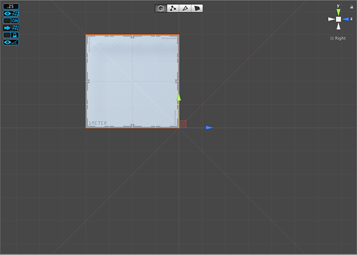 

For example, you can see two diagonal lines appearing in this image in addition to the standard ProGrids horizontal and vertical lines. 

The default angle of these lines is 45 degrees. To change the default angle, set the [Angle](#ortho-angle) property in the [Snap Settings](snapping.md).

----

###  Snap Settings

Use this button to open the **ProGrids Settings** window, where you can set the size (or value) of the snap increment and control the general behavior of ProGrids snapping.

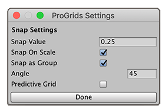

| **Property** | **Description** |
|:--|:--|
| **Snap Value** | Set the increment to snap objects to the grid in World coordinates. You can specify a small snapping size, such as 0.25 units to snap to the grid at every quarter meter. Or you can use a larger value, such as 1.0 unit.  **TIP**: You can also use the **=** and **-** [keyboard shortcuts](hotkeys.md) to quickly increase or decrease (*nudge*) this value without opening the **ProGrids Settings** window. You can also change the keyboard shortcuts for nudging in the **Shortcuts** section of the [ProGrids preferences](preferences.md#shortcuts).  Units are in meters by default, but you can choose a different unit of measurement with the [Grid Units preference](preferences.md). |
| **Snap On Scale** | Enable this option to snap to the grid while you scale the object. |
| **Snap as Group** | Enable this option to keep the relative positions of multiple selected objects when you move them. |
| **Angle** | Set the angle of the additional line that displays when you enable the [Angle Visibility](interface.md#angle-vis) () setting. |
| **Predictive Grid** | Enable this option if you want ProGrids to automatically set the [rendering grid plane](grids.md) according to object movement. For example, if you enable this option and you move your object along the X axis, ProGrids switches to the Z grid plane (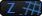).  This option has no effect when the 3D grid plane (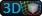) is active. |

----

### Set Grid Planes

These buttons allow you to control where the grid appears relative to the X, Y, and Z axes.

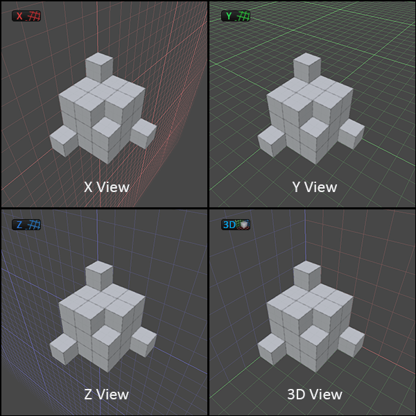 

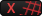 Use this to set the grid to render on the **X** axis (facing to the left/right).

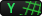 Use this to set the grid to render on the **Y** axis (facing up/down).

 Use this to set the grid to render on the **Z** axis (facing forwards/backwards).

 Use this to render a grid with all 3 axes.

> **TIP**: You can also enable the **Predictive Grid** option on the [Snap Settings](snapping.md) window if you want ProGrids to decide which grid plane to use. 

----

### Keyboard Shortcuts

By default, ProGrids assigns shortcut keys to some common ProGrids actions. If you want to change the key assignments, use one of the following methods to choose a new key (including joystick buttons):

* In Unity versions prior to 2019.1, select the key from the drop-down lists on the [ProGrids preferences](preferences.md#shortcuts) window. 
* In Unity versions starting with 2019.1, open the [Shortcut Manager](https://docs.unity3d.com/Manual/ShortcutsManager.html) to modify your key selections:

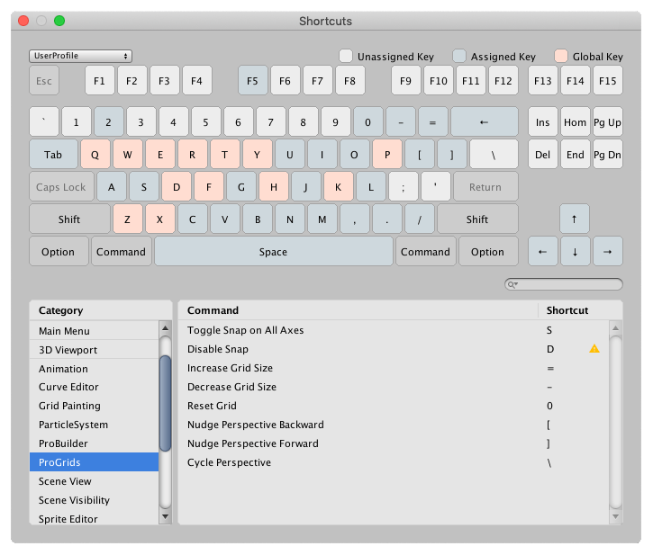

The default key mapping for these ProGrid commands are:

| **ProGrids command**      | **Default key mapping:** | **Description**                                              |
| :----------------------------- | ------------------------ | :----------------------------------------------------------- |
| **Toggle Snap on All Axes**    | **S**                    | Hold **S** to switch to the other [snapping method](preferences.md#behavior). For example, if your **Snap Method** preference is set to **Snap On Selected Axis**, then when you hold **S** down while you move the object, it snaps it on all three axes at once until you release the **S** key. |
| **Disable Snap**               | **D**                    | Hold **D** to temporarily suspend snapping. As soon as you release the key, snapping is enabled again. |
| **Increase Grid Size**         | **=**                    | Doubles the [snap value increment](snapping.md).             |
| **Decrease Grid Size**         | **-**                    | Halves the [snap value increment](snapping.md).              |
| **Reset Grid**    | **0** (zero) | Resets any grid adjustments made by [nudging](snapping.md) (that is, increasing or decreasing the size of the [Snap Value](snapping.md)). |
| **Nudge Perspective Backward** | **[**                    | Moves the grid backward along its axis when objects [follow the grid](preferences.md#follow). |
| **Nudge Perspective Forward**  | **]**                    | Moves the grid forward along its axis when objects [follow the grid](preferences.md#follow). |
| **Cycle Perspective**          | **\\** (backslash) | Cycle through the Scene view Camera orientations in this order:  orthographic X -&gt; orthographic Y -&gt; orthographic Z -&gt; perspective (free) -&gt; orthographic X (again).  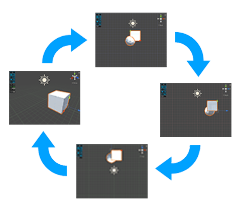 |

These shortcuts are only available when the Scene view is active.

----

## Customizing ProGrids

You can customize many ProGrids features to suit your needs and workflow. For example, you can set custom grid planes, colors, and snap increments.

To access the **ProGrids** tab on the **Preferences** window, go to **Edit** > **Preferences** (Windows) or **Unity** > **Preferences** (Mac) from the main menu in Unity, then select the **ProGrids** category. 

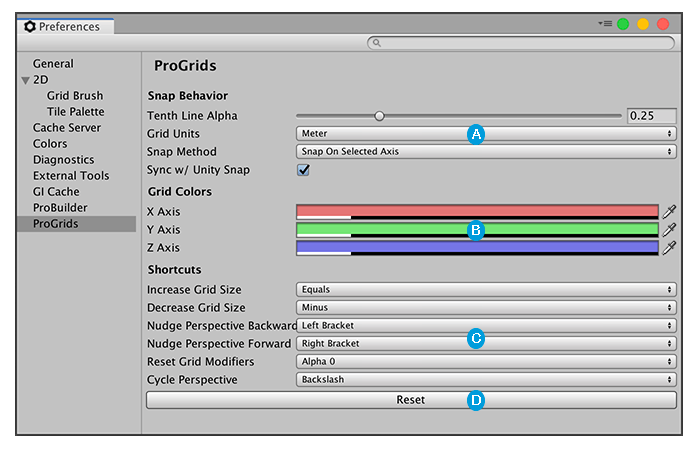 

 Use the [Snap Behavior](#behavior) section to customize ProGrids snapping behavior.

 Use the [Grid Colors](#colors) section to customize how the grid appears.

 Use the [Shortcuts](#shortcuts) section to assign common ProGrids behavior to keys (including joystick buttons).

 Click the **Reset** button to remove all customization and return to ProGrids defaults.

### Snap behavior

These properties control how you interact with ProGrids snapping:

| **Property** | **Description** |
|:--|:--|
|**Tenth Line Alpha** | Every tenth grid line appears more opaque. This value sets that opacity. |
|**Grid Units** | Choose the unit of measurement for the snap value.  Units are in meters by default, but you can also use centimeters, millimeters, inches, feet, yards and parsecs. |
|**Snap Method** | Choose how ProGrids snaps objects you translate to the grid: |
| | **Snap On Selected Axis**: ProGrids snaps only on the selected axis. |
| | **Snap On All Axes**: ProGrids snaps on all three axes at once. |
|**Sync w/ Unity Snap** | Enable this option to update the [Unit snapping](https://docs.unity3d.com/Manual/PositioningGameObjects.html#UnitSnapping) value to match the [Snap Value](snapping.md) property every time you update the **Snap Value** property. |

### Grid Colors

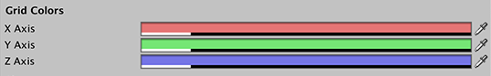 

Set the colors you want to appear on each [grid axis](grids.md). 

This applies to both [orthographic and perspective](https://docs.unity3d.com/Manual/SceneViewNavigation.html) modes.

### Shortcuts

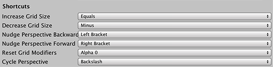 

By default, ProGrids assigns shortcut keys to some common ProGrids actions. If you want to change the key assignments, you can choose a key (including joystick buttons) from these drop-down menus. 

For more information, see [Keyboard Shortcuts](hotkeys.md).
